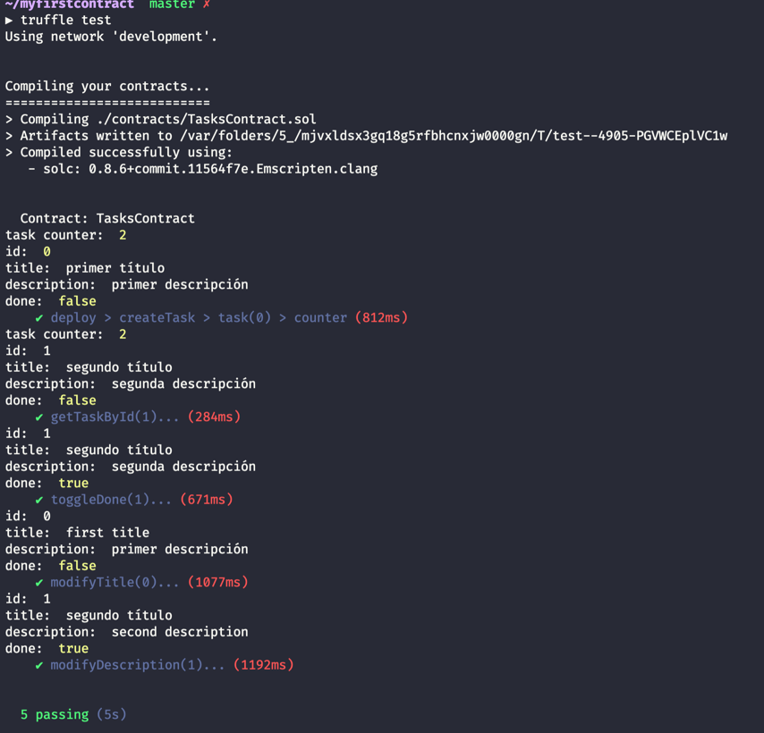

# Truffle TODOs crud solidity contract

## Testing
1. install [ganache](https://https://github.com/trufflesuite/ganache/releases)
2. run ganache and click QUICKSTART
3. verify ganache rcp server 
`ìn my case at: HTTP://127.0.0.1:7545`
4. check it on file `./truffle-config.js` (host and port)
5. run in console: `truffle compile`
5. run in console: `truffle test`



### List of Task's
```
struct Task {
    uint id;
    string title;
    string description;
    bool done; 
    uint crateAt;
}
```


### items: 

- `taskcounter` uint
- `tasks` Task

### functions:

- `createTask()` void
- `getTaskById()` [Task]
- `modifyTitle()` void
- `modifyDescription()` void
- `toggleDone()` void
### internal function 
- `findIndexById()` uint